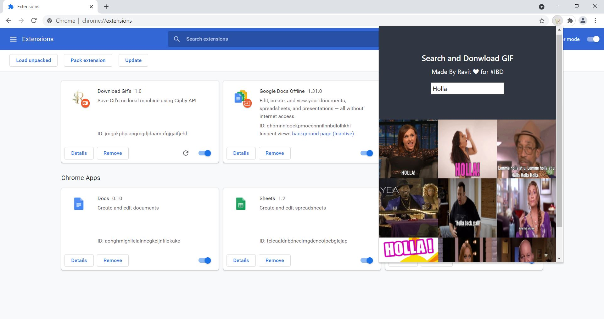

# Chrome-Extension-Gif Downloader Via Giphy API

This extension allows a user to search and download GIF's on a local machine.

## Demo Video
 For Demo Video, [Click Here](https://youtu.be/esa4Y3n3DdA).

## ScreenShot

## Procedure to Install
- You can download the root folder or fork it and clone to your local machine.
- Then go to ``chrome://extensions`` or ``edge://extensions`` or ``brave://extensions`` depending on Chromium Browser.
- Click load unpacked package and simply select the root folder.
- Voila ! There's your Chrome Extension Up and Running.

## Author
- Made by Ravit Garg

## Contribute
- Feel free to contribute in the project.
